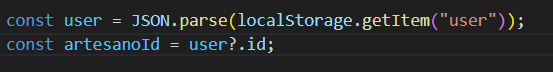

# 1.- Realización de peticiones desde el front al back. 
    Al parecer se puede hacer de formas distintas a como hemos aprendido en el curso. Actualmente, la petición la realizamos desde un script que tenemos relacionado con el front en el que realizamos algo como esto: 

    ```js
    URL_API = "http://localhost:3000/api";

    async function cargarDatos(nombre, descripcion, imagen_url, categoria, precio, stock, comprar_url, activo){
        try{
            const respuesta = await fetch (`${URL_API}/productos`,{
                method: 'POST',
                headers: {'Content-Type':'application/json'},
                body: JSON.stringify({nombre, descripcion, imagen_url, categoria, precio, stock, comprar_url, activo})
            });

            const datos= await respuesta.json();
            console.log("Respuesta productos:", respuesta.status, datos);

            if(respuesta.ok){
                
                alert(`Producto creado, ${datos.productoId}`);
            }
            else{
                alert(datos.message || "Error al crear producto, fallo de comunicación del front y el backend");
            }
        }catch (error){
            console.error("Error al guardar los datos", error);
            alert("Error al guardar el producto");
        }
    }
    ```

Pero, al parecer podemos realizar lo mismo, pero desde HTML y bastante más sencillo, PERO AÚN TENGO QUE COMPROBAR SI ES CIERTO Y SI FUNCIONA!!

``` HTML
<form action="http://localhost:3000/api/productos" method="POST">
  <input type="text" name="nombre" placeholder="Nombre">
  <input type="number" name="precio" placeholder="Precio">
  <button type="submit">Guardar</button>
</form>
```
Como vemos aquí, dentro de la etiqueta formulario, indicamos la ruta a la que queremos realizar la petición, que, en este caso, es POST para subir los datos que el usuario nos proporciona desde el front. 


DIFERENCIAS: 
--> El método por HTML es limitado, recarga la página y no puedes llevar a cabo validaciones. 
--> Con fetch, es más complejo, pero puedes elegir como se envían los datos, puedes hacer que la página no se recargue luego al realizar una petición de escucha del botón con e.preventDefault()

--> HTML, es más antiguo y rígido.
--> fetch, es más moderno y programable.

# 2.- Como traer la id desde localStorage "user"
*    Una vez que el usuario ha iniciado sesión, en localStorage se guardan sus datos (id,nombre, correo, etc) depende de los datos que hayamos indicado que queremos que se guarden. Pues como ahora queremos traer un dato concreto, que es la id, de localStorage para usarlo para localizar al usuario y poder clasificar los productos por usuario, para ello traemos el dato de la siguiente forma: 
    